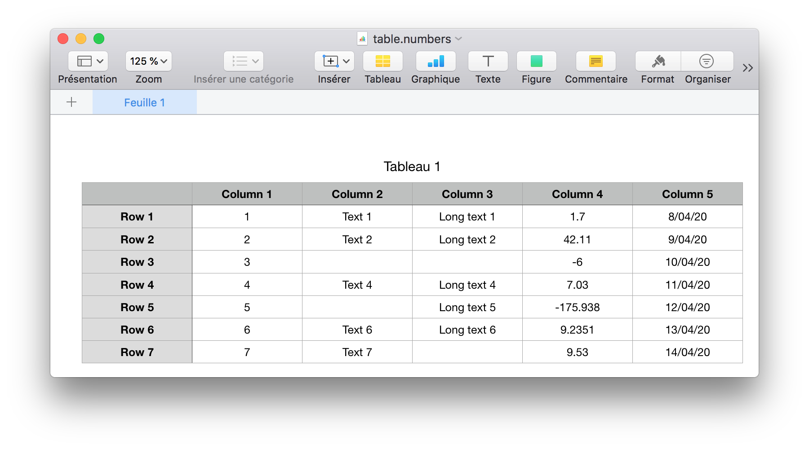
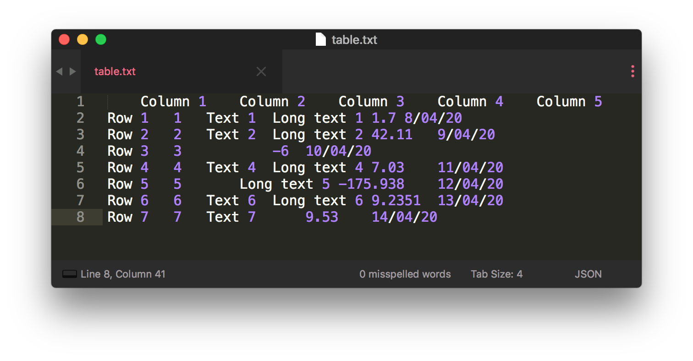

# Excel to text

It is quite tedious to edit Markdown or LaTeX tables. Especially, when you have to edit them many times (add a column, move a cell, etc.). In these cases, it is more convenient to use a WYSIWYG software like Excel or Apple Numbers. This is why "Excel to text" was created.

Excel to text is a tiny scripy based on [python-tabulate](https://github.com/astanin/python-tabulate/blob/master/tabulate.py) aims to convert an Excel, [Numbers](https://www.apple.com/numbers/) or [Notes](https://support.apple.com/HT205773) table to text, LaTeX, Markdown, reStructuredText, etc. Basically, it is an extended version of the python-tabulate's CLI supporting column alignment.

### How to install

Run the following command to install Excel to text:

```sh
$ pip3 install .
```

### How to use it

First at all, select a table in Microsoft Excel, Apple Numbers or Apple Notes and copy paste it into a text editor (such as [Sublime Text](https://www.sublimetext.com), [Atom](https://atom.io) and [TextEdit](https://support.apple.com/guide/textedit/welcome/mac)).

Secondly, run the following command:

```sh
$ excel-to-text <my_file>
```

where `<my_file>` is the text file. The formatted table will be print in the terminal.

See the next sections to customize the formatted table and to see some examples of use.

### Usage of the CLI

```
usage: excel-to-text [-h] [-1] [-o OUTPUT] [-F FLOAT]
                     [-f {plain,simple,github,grid,fancy_grid,pipe,orgtbl,rst,mediawiki,html,latex,latex_raw,latex_booktabs,tsv}]
                     [-c {right,center,left,decimal,none} [{right,center,left,decimal,none} ...]]
                     file

positional arguments:
  file                  Path of the input text file.

optional arguments:
  -h, --help            Show this help message and exit.
  -1, --no-header       Do not use the first row of data as a table header.
  -o OUTPUT, --output OUTPUT
                        Print table to an output file. It defaults to
                        `stdout`.
  -F FLOAT, --float FLOAT
                        Floating point number format. It defaults to `g`.
                        Refer to the Python's documentation: https://docs.pyth
                        on.org/3/library/string.html#formatspec
  -f {plain,simple,github,grid,fancy_grid,pipe,orgtbl,rst,mediawiki,html,latex,latex_raw,latex_booktabs,tsv}, --format {plain,simple,github,grid,fancy_grid,pipe,orgtbl,rst,mediawiki,html,latex,latex_raw,latex_booktabs,tsv}
                        Output table format. It defaults to `simple`.
                        Available formats detailed on the following website:
                        https://github.com/astanin/python-tabulate
  -c {right,center,left,decimal,none} [{right,center,left,decimal,none} ...], --col-align {right,center,left,decimal,none} [{right,center,left,decimal,none} ...]
                        Alignment of columns. If more than one alignment is
                        provided, set alignment for each column separately. It
                        defaults to `['center']`. Available column alignments
                        detailed on the following website:
                        https://github.com/astanin/python-tabulate
```

### Examples

Suppose that we have the following table in Microsoft Excel, Apple Numbers or Apple Notes. Notice that some cells are empty.



By copying pasting it in a text file, we get the following.



Then, we save it in `docs/example/table.txt`.

Afterwards, we can use the script to format the table. Below, some examples of formatting are given.

- Use default arguments.

```sh
$ excel-to-text docs/example/table.txt
        Column 1    Column 2    Column 3     Column 4    Column 5
-----  ----------  ----------  -----------  ----------  ----------
Row 1      1         Text 1    Long text 1     1.7       8/04/20
Row 2      2         Text 2    Long text 2    42.11      9/04/20
Row 3      3                                    -6       10/04/20
Row 4      4         Text 4    Long text 4     7.03      11/04/20
Row 5      5                   Long text 5   -175.938    12/04/20
Row 6      6         Text 6    Long text 6    9.2351     13/04/20
Row 7      7         Text 7                    9.53      14/04/20
```

- Use [Markdown table format](https://github.com/adam-p/markdown-here/wiki/Markdown-Cheatsheet#tables) ([python-tabulate](https://github.com/astanin/python-tabulate) lists and shows all formats you can use) and change the floating point number format (see the [Python's documentation](https://docs.python.org/3/library/string.html#formatspec)).

```sh
$ excel-to-text docs/example/table.txt -f pipe -F .1f
|       |  Column 1  |  Column 2  |  Column 3   |  Column 4  |  Column 5  |
|:-----:|:----------:|:----------:|:-----------:|:----------:|:----------:|
| Row 1 |     1      |   Text 1   | Long text 1 |    1.7     |  8/04/20   |
| Row 2 |     2      |   Text 2   | Long text 2 |    42.1    |  9/04/20   |
| Row 3 |     3      |            |             |    -6.0    |  10/04/20  |
| Row 4 |     4      |   Text 4   | Long text 4 |    7.0     |  11/04/20  |
| Row 5 |     5      |            | Long text 5 |   -175.9   |  12/04/20  |
| Row 6 |     6      |   Text 6   | Long text 6 |    9.2     |  13/04/20  |
| Row 7 |     7      |   Text 7   |             |    9.5     |  14/04/20  |
```

- By default, the columns of the table are centred, but you can change this behaviour by specifying `-c` argument. Here is an example using [LaTeX table format](https://en.wikibooks.org/wiki/LaTeX/Tables) and a left alignment.

```sh
$ excel-to-text docs/example/table.txt -f latex -c left
\begin{tabular}{llllll}
\hline
       & Column 1   & Column 2   & Column 3    & Column 4   & Column 5   \\
\hline
 Row 1 & 1          & Text 1     & Long text 1 & 1.7        & 8/04/20    \\
 Row 2 & 2          & Text 2     & Long text 2 & 42.11      & 9/04/20    \\
 Row 3 & 3          &            &             & -6         & 10/04/20   \\
 Row 4 & 4          & Text 4     & Long text 4 & 7.03       & 11/04/20   \\
 Row 5 & 5          &            & Long text 5 & -175.938   & 12/04/20   \\
 Row 6 & 6          & Text 6     & Long text 6 & 9.2351     & 13/04/20   \\
 Row 7 & 7          & Text 7     &             & 9.53       & 14/04/20   \\
\hline
\end{tabular}
```

- Also, you can specify the alignment for each column. Here is an example with `left`, `center`, `right` and `decimal` alignments.

```sh
$ excel-to-text docs/example/table.txt -f pipe -c left center left left decimal right
|       |  Column 1  | Column 2   | Column 3    |   Column 4 |   Column 5 |
|:------|:----------:|:-----------|:------------|-----------:|-----------:|
| Row 1 |     1      | Text 1     | Long text 1 |     1.7    |    8/04/20 |
| Row 2 |     2      | Text 2     | Long text 2 |    42.11   |    9/04/20 |
| Row 3 |     3      |            |             |    -6      |   10/04/20 |
| Row 4 |     4      | Text 4     | Long text 4 |     7.03   |   11/04/20 |
| Row 5 |     5      |            | Long text 5 |  -175.938  |   12/04/20 |
| Row 6 |     6      | Text 6     | Long text 6 |     9.2351 |   13/04/20 |
| Row 7 |     7      | Text 7     |             |     9.53   |   14/04/20 |
```

- Specify an output file, do not set any header and use [reStructuredText table format](https://docutils.sourceforge.io/docs/user/rst/quickref.html#tables).

```sh
$ excel-to-text docs/example/table.txt -1 -f rst -o docs/example/formatted_table.txt
$ cat docs/example/formatted_table.txt
=====  ========  ========  ===========  ========  ========
 ..    Column 1  Column 2   Column 3    Column 4  Column 5
Row 1     1       Text 1   Long text 1    1.7     8/04/20
Row 2     2       Text 2   Long text 2   42.11    9/04/20
Row 3     3                                -6     10/04/20
Row 4     4       Text 4   Long text 4    7.03    11/04/20
Row 5     5                Long text 5  -175.938  12/04/20
Row 6     6       Text 6   Long text 6   9.2351   13/04/20
Row 7     7       Text 7                  9.53    14/04/20
=====  ========  ========  ===========  ========  ========
```
